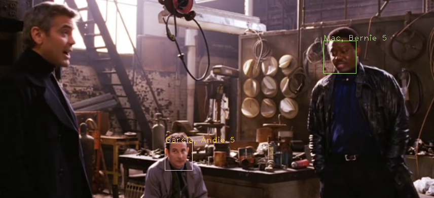
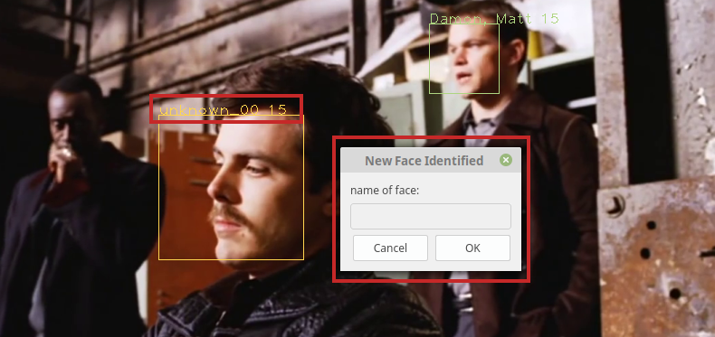
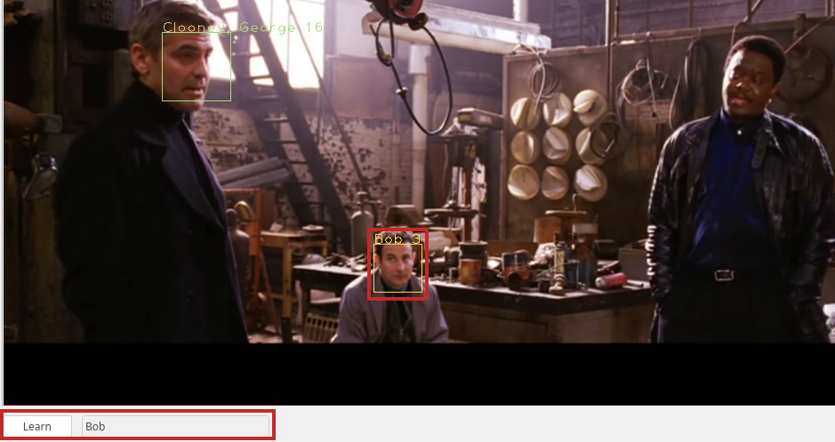
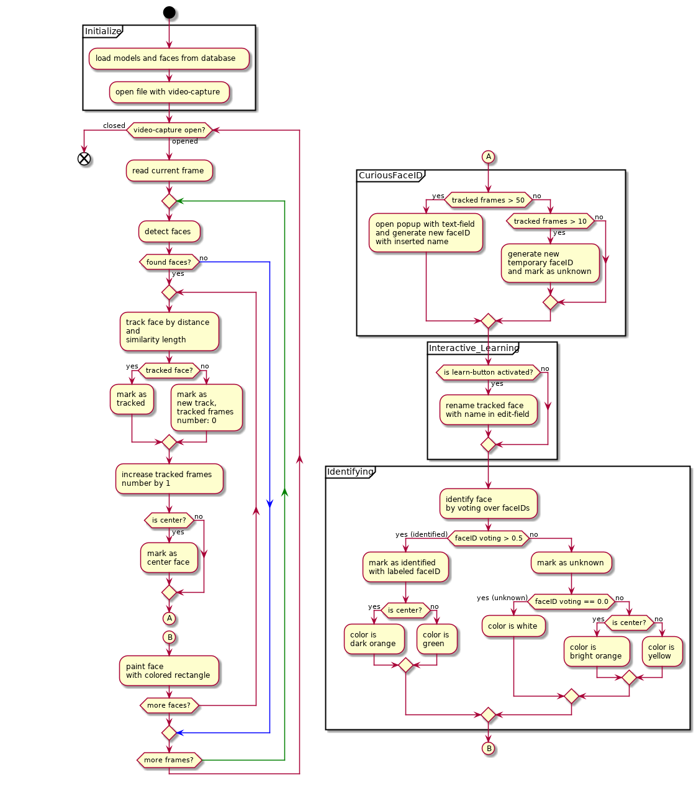
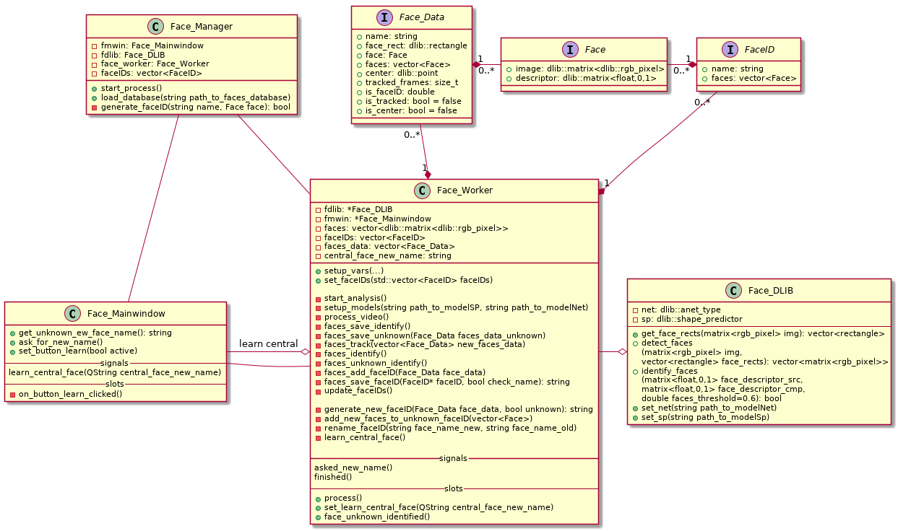

# FaceID

## Motivation

FaceID is a project for the module _Grundlagenprojekt Intelligente Systeme_.\
The target for the application was to build a tool which can detect a face on an image and label an identified face with a name from a database.
The program should also track faces over frames. If a face is tracked for more than ten frames, the application should label this face with as unknown and save the data intern temporary. If the same track was tracked over 50 frames, the tool should display a popup, where the user can insert a custom name for this face.\
Another task FaceID should do, is to let the user define a name for the face, which is the nearest to the center-point of the current face.\
FaceID should also view different identification-states by differently coloring the rectangle surrounded in the detected faces.

For the recognition of the faces the pretrained model with deep metric by dlib-library is used. With this model FaceID can correctly predict, that two images of faces are from a similar person, with an accuracy of 99.38%.

<div style="page-break-after: always;"></div>

## Usage

### Requirements

The following libraries are required:

* **Boost**
  (>= v.1.66)\
  (for program options and filesystem)
* **DLIB C++ library**
  (>= v. 19.8)\
  (for detecting and identifying the faces)
* **OpenCV**
  (>= v.3.4)\
  (to open the files via a video-capture and images)
* **Qt**
  (>= v.5.11)\
  (GUI)

#### Models

The program also needs two models for the face recognition.\
One model is a model of DNN responsible for face recognition\
[download from <http://dlib.net/files/dlib_face_recognition_resnet_model_v1.dat.bz2>]\
and the second is the model with a face landmarking model\
[download from <http://dlib.net/files/shape_predictor_5_face_landmarks.dat.bz2]>.

#### Database

FaceID also needs a folder with the face images of the known persons, which should look like the following examples:

\
*example folder for known faceIDs/ persons, the folder-names are the names of the faceIDs

\
*example folder of one faceID/ person with example face images
(double folder is for duplicates founded by FaceID in the loading step)

<div style="page-break-after: always;"></div>

### Build

To build FaceID run

```shell
mkdir build
cd build
cmake ..
make
```

and open it with

```shell
./faceID --help
Usage:
    --help              help
    --file (=../data/faces_examples_dlib/faces/bald_guys.jpg)
                        path to file
    --faces_database    path to database of faces
    --save_faces        save new identified 
                        faces in database?
  --modelNet
    (=../data/model_dlib/dlib_face_recognition_resnet_model_v1.dat)
                        path to the file of DNN
                        responsible for
                        face identification [download example
                        from
     http://dlib.net/files/dlib_face_recognition_resnet_model_v1.dat.bz2]

  --modelSP 
    (=../data/model_dlib/shape_predictor_5_face_landmarks.dat)
                        path to the file with a face
                        landmarking model [download example
                        from 
          http://dlib.net/files/shape_predictor_5_face_landmarks.dat.bz2]
  --faces_thres (=0.6)
                        threshold for distance of two faces
  --faces_voting_thres (=0.5)
                        threshold for faces voting
```

<div style="page-break-after: always;"></div>

### Applications

#### Face Identification

Face Identification is the main part of FaceID. The detected faces will be identified. Based on the identification the rectangles surrounded by the face have different colors. The color is green, when the identification is over 50% correctly predicted. If this voting is under 50% the color will be yellow and white, when the face was not identified that means the voting is 0. For the face, which is nearest to the center, the colors will be a dark orange for identified persons and bright orange for not identified persons.

\
*from ocean's twelve - official trailer\
(Above the rectangle of the detected face the name of the identified person will be displayed with a number for the tracked frames.)

<div style="page-break-after: always;"></div>

#### Automatic Face Learning

Another task of FaceID is to automatically learn new faces after it was tracked for a certain number of frames.
If a face is tracked for more than 10 frames a temporary faceID will be created.
If this tracked face will be there for additional 40 frames a popup appears. The program waits for a name, which the user has to fill into the edit line in the popup. After this FaceID will rename the previously temporary created faceID with this name and save it in the database.

\
*from ocean's twelve - official trailer\
(The highlighted name shows the temporary created faceID for a person, which is tracked over 10 frames. The popup views the edit-line for the custom name.)

<div style="page-break-after: always;"></div>

#### Interactive Face Learning

The third task of this tool is, that the user can define the label of the face in the center.
With the edit line in the GUI the user can type the name and execute the learning with the 'Learn'-button.\
After the user clicked on the button the program will read the name from the edit-line and create a new faceID of the face, which is nearest to the center-point of the current frame. If the face was identified with a known faceID, FaceID will rename the identified faceID with the name, which is inserted in the edit-line. The nearest face to the center-point will be determined by calculating the minimum of all lengths from the center-point of the faces' rectangle to the center-point of the current frame.

\
*from ocean's twelve - official trailer\
(The highlighted area at the bottom shows the learn-button and edit-line. The highlighted face shows the renamed face after the user clicked on the button)

<div style="page-break-after: always;"></div>

## Implementation



<div style="page-break-after: always;"></div>

### Project Structure



**Face_Manager** *(face_manager.cpp, face_manager.h)*

This class loads the data from the database. It saves all known persons in a vector of faceIDs [see struct FaceID], loads the images of each person in the vector of faces [see struct Face] from the proper faceID and creates the face descriptor of each image. Then it sends this data to the worker-thread [see Face_Worker].

**Face_Worker** *(face_worker.cpp, face_worker.h)*

This is the basic part of the application. The class is the worker-thread in which the content of the file is being processed frame by frame. See the process-pipeline for detailed steps.

**Face_Mainwindow** *(face_mainwindow.cpp, _face_mainwindow.h)*

This is a mainwindow from Qt and creates the GUI of the application and displays the processed data from the face-worker thread. It also has functions for the learn-button and generates the popup for the automatic learning of faces.

**Face_Dlib** *(face_dlib.cpp, face_dlib.h)*

This class handles the functions, which needs the dlib-library as dependency. It has a function for the comparing of two faces. The distance between two face descriptors will be calculated. If the value is smaller than the threshold, which is defined in the program options or the default value of 0.6. Also the two models will be loaded in this class.

**Face_Structs** *(face_structs.h)*

This file contains the structs *Face*, *FaceID* and *Face_Data*.

*Face* has a variable for the image and descriptor.

*FaceID* has a string for the name of the person and also has a vector of the struct faces.

*Face_Data* is the struct, which is used for saving the data for one detected face. It has a string for the name, which can be unknown or the name of the identified person. This also saves the corresponding rectangle, image and descriptor of the face. The point of the center of the rectangle is saved in a variable, too.

The struct FaceID is used for saving and loading the persons from the database. Face_Data is used for having the detected faces with all the relevant data in one variable. The struct Face is created for having the image-data and descriptor of faces together.

### Process-Pipeline

FaceID starts with the preparation of some variables and the command-line arguments.
It stores the paths of the file, model of DNN responsible for face identification and file with a face landmarking model. Optionally the application loads the threshold of distance between two face descriptors and the threshold of voting if a face is the faceID.\
On the next step FaceID loads the database based on the path of the "--faces_database"-command-line-argument.\
After it loaded the known faces in the database the application starts the process of the thread-worker. And runs the GUI. \
Inside the thread-worker FaceID starts with loading the frames frame by frame from a video file, image or webcam while the video-capture is open. In this loop it takes the current frame and detects the faces. If the detector founded faces the identifying process is being started. In this step the tracker first checks if the face was founded in the previous frame. Next the faces are checked if the tracked face is unknown. If it is an unknown tracked face and is tracked for more than ten frames a temporary faceID will be created. If this track is being tracked for more than 50 frames a popup will appear to let the user define a name of the tracked face and this track will be saved.\
After this all faces are checked by the identifier. The identifier checks if the distance between the detected face-descriptor and all faces from each faceID is smaller than the threshold of distance, then it divides this counter with the number of existing faces of each faceID and takes the faceID with the maximum number. If this voting-number is greater than the corresponding threshold, the identifier labels the detected face with this faceID.\
Optionally new faces are being saved into an unknown folder in the given database.\
At last the processed faces' rectangle are being painted on the frame colored based on the voting by the identification.\
If the video-capture is released, the loop is finished. The thread-worker, GUI and application will be closed.

<div style="page-break-after: always;"></div>

### Challenges

Difficult was to get the best database structure for this application. Using a json-based database wasn't a good idea for this application, because the saved data was only in textual characters. So a better solution was to use the images in a folder-structure, where the title of the folders are the names of the person.\
Also difficult was to avoid saving faces in a folder with an already existing name. That the voting for one faceID are remaining correctly, a new folder with a new faceID-name has to be created. So the new person's name has an increasing number additional to its given name. Another way could be to only create an identification-number, so that there are unique names.\
Another challenge was to avoid segmentation failures with the two threads in FaceID. This problem was solved with mutex-locks surrounded by dangerous variables respectively code-blocks.